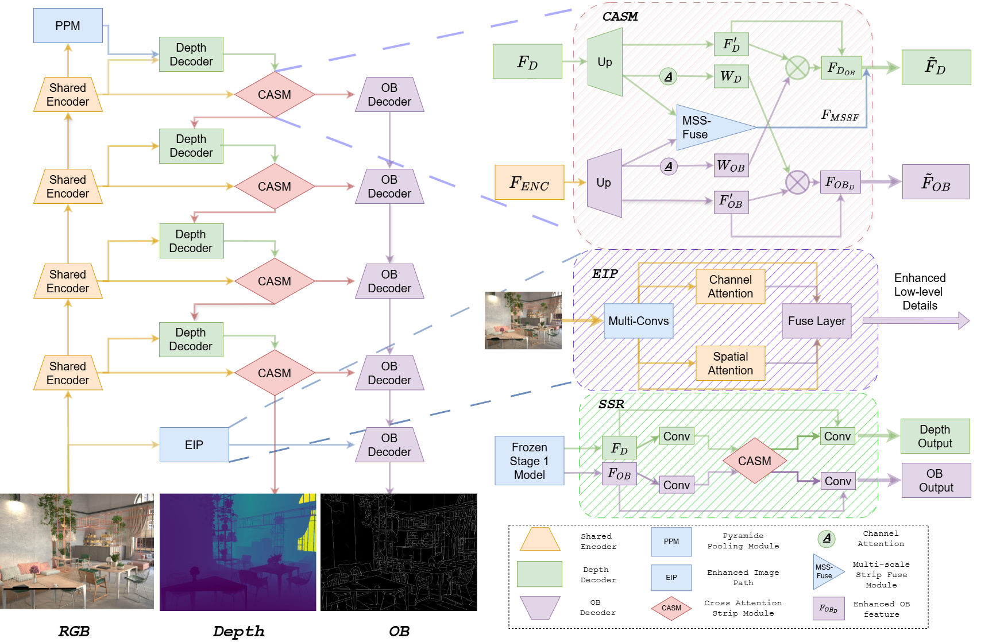

# MoDOT

Official implementation of the paper: **Occlusion Boundary and Depth: Mutual Enhancement via Multi-Task Learning** (WACV 2026 Oral).

In this work, we are the first to investigate the joint learning of occlusion boundary (OB) estimation and monocular depth estimation. As the two tasks provide complementary cues for understanding 3D scene geometry, our experiments demonstrate that incorporating OB supervision:

- improves depth estimation accuracy,
- yields sharper and more consistent boundaries,
- mitigates artifacts caused by high-frequency textures, and
- enhances the overall quality of 3D scene understanding.

------

# Conconet

This repository provides the PyTorch implementation of our proposed **MoDOT** framework, along with all necessary resources:

- **`modot/`**: core MoDOT network architecture, losses, training & evaluation pipeline.
- **`configs/` & `scripts/`**: hyperparameters and `.sh` files for training and testing.
- **`data_splits/`**: train/test split files for main datasets used in the paper.

The general pipeline of MoDOT:

<p align="center">  </p>

------

## Dependencies

First, set up the Python environment using the provided `requirements.txt`.

```
# (Optional) create a virtual environment
# pip install wandb
pip install -r requirements.txt
```

------

## Data Preparation

For **OB-Hypersim**, we provide zipped sets containing images, depth maps, semantic segmentation, normals, instance contours, P2ORM OBs, and occlusion orientation maps (note: a few orientation files may be missing). We thank the authors of [P2ORM](https://github.com/tim885/P2ORM) and [Hypersim](https://github.com/apple/ml-hypersim) for their excellent work.

We also provide the **NYUD-MT** dataset and related files in the following repository. For other datasets used in the main paper and supplementary material, please refer to their official sources: [OB-FUTURE / OB-DIODE / OB-EntitySeg](https://github.com/xul-ops/IOBE), [DIODE (val)](https://diode-dataset.org/), [iBims-1](https://mediatum.ub.tum.de/1455541), and others cited in the paper.

Download link (OB-Hypersim & NYUD-MT):

- **BaiduNet:** https://pan.baidu.com/s/1gw_t4Mz2Y4jBEO36i9awPA
- **Extraction code:** `9doj`

------

## Configuration

- Update dataset paths and split files in **`configs/config.yml`**.
- Adjust parameters in **`parse_args.py`** and corresponding config text files in  **`configs/`** if needed.

------

## Training & Inference

Run the following scripts to train or evaluate MoDOT:

```
# MoDOT
sh scripts/train_eval.sh

# MoDOT with SSR
sh scripts/ssr_train_eval.sh

# Zero-shot evaluation
sh scripts/zero-shot_eval.sh
```

------

## Pre-trained Checkpoints

Download pre-trained MoDOT checkpoints from the link provided above.

------

## Acknowledgments

We thank the following projects for providing code or inspiration: [NeWCRFs](https://github.com/aliyun/NeWCRFs), [MTORL](https://github.com/fengpanhe/MT-ORL), [Python Edge NMS](https://github.com/Walstruzz/edge_eval_python?tab=readme-ov-file) and other related works acknowledged in our paper.

------

Gmail: **xulintaofr@gmail.com**

If our project is helpful for your research, please consider citing:

```
@article{xu_MoDOT,
  title={Occlusion Boundary and Depth: Mutual Enhancement via Multi-Task Learning},
  author={Xu, Lintao and Wang, Yinghao and Wang, Chaohui},
  booktitle = {Proceedings of the Winter Conference on Applications of Computer Vision (WACV)},
  year      = {2026},
}
```

------

